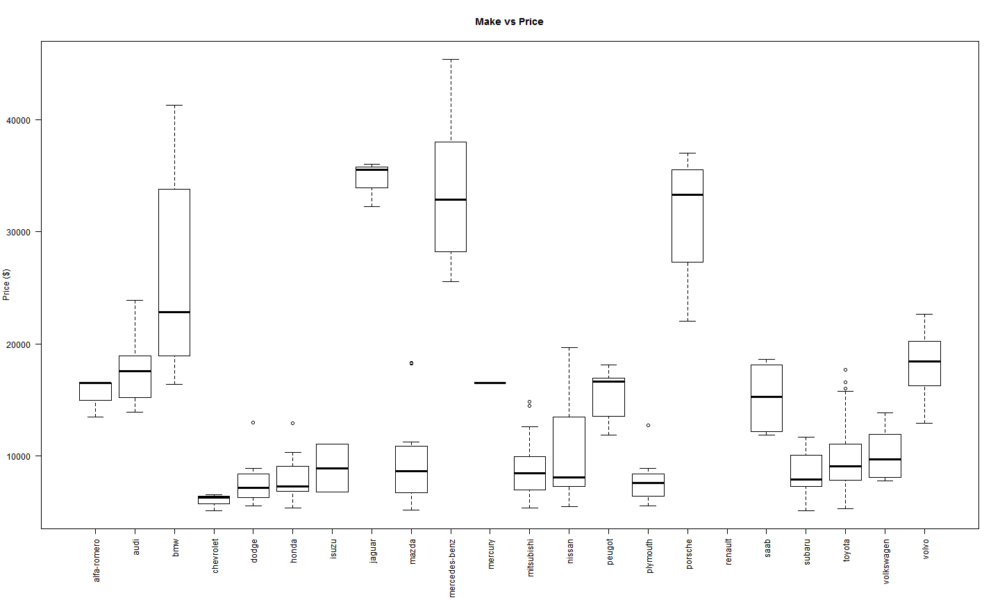

<style>
.small-code pre code {
  font-size: 1em;
}
</style>


CarPricePrediction
========================================================
author: Chris Benson
date:   24/10/2015
width:  1920
height: 1080
font-family: 'Helvetica'


Introduction
========================================================
The data we are using comes from the UCI Automobile Data Set that can be found in this link http://archive.ics.uci.edu/ml/datasets/Automobile.

Using this dataset we build a linear regrssion model over several variables and then predict the price of a car given these same variables. In order to achieve the outcome there were several steps:

- Explatory Data Analysis
- Clean the Data
- Build the model
- Run a prediction on the model 

We used the following variables from the automobile dataset to create the prediction: Make, Body Style, Engine Size, Horsepower, and Highway MPG. this is demonstrated through the following shiny app: https://chrisbens.shinyapps.io/CarPricePrediction

Exploratory Data (Make vs Price)
========================================================
 

The Model
=======================================================
class: small-code
Below we show the variable and where the model is built. We then use the "anova" package to display the Variance Table.

```r
mod <- lm(price ~ make + body_style + engine_size + horsepower + highway_mpg, data=dfCars)
summary(mod) # show results
```

```

Call:
lm(formula = price ~ make + body_style + engine_size + horsepower + 
    highway_mpg, data = dfCars)

Residuals:
    Min      1Q  Median      3Q     Max 
-5012.4 -1023.3   -12.6   842.6  9848.5 

Coefficients:
                    Estimate Std. Error t value Pr(>|t|)    
(Intercept)         -1183.37    2898.30  -0.408  0.68358    
makeaudi             4930.19    1743.98   2.827  0.00528 ** 
makebmw              9159.25    1695.50   5.402 2.27e-07 ***
makechevrolet        -612.57    2020.63  -0.303  0.76215    
makedodge           -1374.83    1663.20  -0.827  0.40965    
makehonda            -548.08    1595.83  -0.343  0.73170    
makeisuzu           -1020.45    2157.68  -0.473  0.63688    
makejaguar           5871.73    2258.60   2.600  0.01018 *  
makemazda             270.58    1612.13   0.168  0.86691    
makemercedes-benz   11864.33    1837.73   6.456 1.15e-09 ***
makemercury           274.39    2685.13   0.102  0.91873    
makemitsubishi      -1964.10    1581.16  -1.242  0.21593    
makenissan          -1694.06    1558.49  -1.087  0.27863    
makepeugot           2918.78    1655.08   1.764  0.07966 .  
makeplymouth        -1572.41    1686.92  -0.932  0.35264    
makeporsche         10280.82    1857.27   5.535 1.20e-07 ***
makesaab             2587.21    1719.65   1.504  0.13436    
makesubaru          -1128.82    1612.12  -0.700  0.48478    
maketoyota           -973.28    1499.83  -0.649  0.51729    
makevolkswagen        225.88    1578.29   0.143  0.88637    
makevolvo            3512.73    1622.27   2.165  0.03180 *  
body_stylehardtop   -3096.05    1293.71  -2.393  0.01783 *  
body_stylehatchback -3106.18    1117.96  -2.778  0.00610 ** 
body_stylesedan     -2454.21    1111.26  -2.208  0.02859 *  
body_stylewagon     -2504.63    1182.44  -2.118  0.03566 *  
engine_size            74.02      11.72   6.318 2.37e-09 ***
horsepower             54.00      13.36   4.041 8.14e-05 ***
highway_mpg            29.38      54.07   0.543  0.58754    
---
Signif. codes:  0 '***' 0.001 '**' 0.01 '*' 0.05 '.' 0.1 ' ' 1

Residual standard error: 2189 on 165 degrees of freedom
Multiple R-squared:  0.9371,	Adjusted R-squared:  0.9268 
F-statistic: 91.01 on 27 and 165 DF,  p-value: < 2.2e-16
```
From these results and the results on the next slide, this model has a pretty good fit over the data. A Residual standad error of 2189 and an Adjusted R^2 value is 0.93 provides for a good model. 


Summary
=======================================================
class: small-code
If we run a predict command over the model using some new data, we get the following prediction

```r
make = "nissan"
body_style = "sedan"
engine_size = 140
horsepower = 100
highway_mpg = 25

newCar <- data.frame(make, body_style, engine_size, horsepower, highway_mpg) 
pred <- predict(mod, newCar, interval = "prediction")
pred
```

```
       fit     lwr     upr
1 11165.86 6606.92 15724.8
```
The 95% prediction interval for the above variables puts the price of a nissan   sedan  with an engine size of  140 , horsepower of  100  and an average Highway MPG of  25 between $6607 and $15725 with a fit of $11166.

This can also be demonstrated through the use of the shiny application:  https://chrisbens.shinyapps.io/CarPricePrediction


